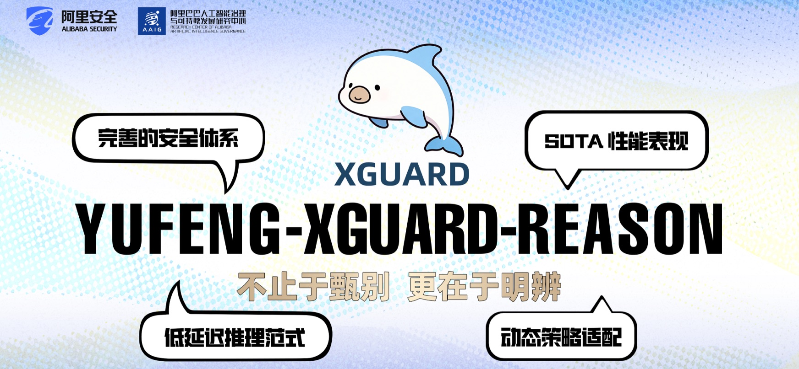
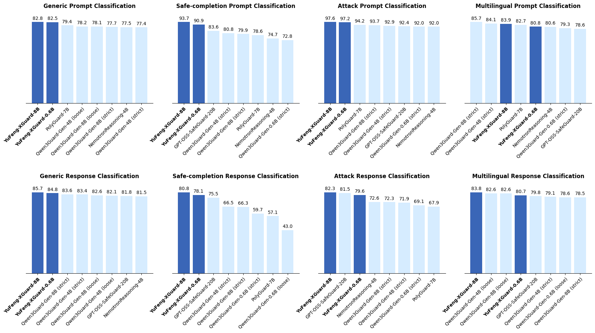

<p align="center">
  
</p>

<p><br></p>

<div align="center">
  <h1 style="margin: 0;">YuFeng-XGuard: A Reasoning-Centric, Interpretable, and Flexible Guardrail Model for Large Language Models</h1>
</div>

<p align="center">
        &nbsp&nbsp🤗 <a href="https://huggingface.co/collections/Alibaba-AAIG/yufeng-xguard-reason">HuggingFace</a>&nbsp&nbsp | 
        &nbsp&nbsp🤖 <a href="https://modelscope.cn/collections/Alibaba-AAIG/YuFeng-XGuard-Reason">ModelScope</a>&nbsp&nbsp |
        &nbsp&nbsp🎬 <a href="https://modelscope.cn/studios/Alibaba-AAIG/YuFeng-XGuard-Reason-Demo/summary">Demo</a>&nbsp&nbsp |
        &nbsp&nbsp📄 <a href="https://arxiv.org/abs/2601.15588">Paper</a>&nbsp&nbsp
</p>

---

## 🐬 Introduction

**YuFeng-XGuard-Reason** is a series of guardrail models specifically designed for content safety. It is engineered to accurately identify security risks in user requests, model responses, and general text, while providing configurable risk attribution information.

Built on the **Qwen3** architecture, the models are deeply optimized for online real-time interaction scenarios, balancing inference latency, recognition precision, and policy extensibility. To maximize explainability while minimizing generation overhead, the model adopts a two-stage output paradigm: it prioritizes outputting structured risk conclusions, followed by detailed risk explanations as needed. Currently, the models have achieved State-of-the-Art performance across multiple content safety benchmarks, including multilingual risk identification, attack instruction defense, and safety completion.

### Key Features

*   **Multi-Scale Coverage**: Available in **0.6B** and **8B** parameter versions. The 0.6B version focuses on ultra-fast inference for high-concurrency, low-latency real-time scenarios; the 8B version focuses on complex risk understanding with higher recognition accuracy.
*   **Low-Latency Inference Paradigm**: Utilizes a two-stage output strategy where the first token prioritizes risk judgment (classification and score), followed by risk attribution (key triggers and compliance explanations). This ensures both immediate decision-making and audit transparency.
*   **Comprehensive Safety Taxonomy**: Features a built-in, wide-ranging taxonomy for general safety and compliance, deeply adapted for regulatory scenarios and high-risk content identification.
*   **Dynamic Policy Adaptation**: The 8B version supports the dynamic introduction of custom safety categories or adjustment of existing criteria via prompts at inference time. This allows businesses to iterate on defense policies rapidly without frequent model fine-tuning.

### Evaluation

YuFeng-XGuard-Reason has been benchmarked against mainstream guardrail models across many content safety datasets. For more detailed data, please refer to our [technical report](https://arxiv.org/pdf/2601.15588).



<p><br></p>

## 🚀 Quick Start

**Loading the Model**

```python
import torch
from transformers import AutoModelForCausalLM, AutoTokenizer

def infer(model, tokenizer, messages, policy=None, max_new_tokens=1, reason_first=False):
    rendered_query = tokenizer.apply_chat_template(messages, policy=policy, reason_first=reason_first, tokenize=False)
    
    model_inputs = tokenizer([rendered_query], return_tensors="pt").to(model.device)
    
    outputs = model.generate(**model_inputs, max_new_tokens=max_new_tokens, do_sample=False, output_scores=True, return_dict_in_generate=True)

    batch_idx = 0
    input_length = model_inputs['input_ids'].shape[1]

    output_ids = outputs["sequences"].tolist()[batch_idx][input_length:]
    response = tokenizer.decode(output_ids, skip_special_tokens=True)
    
    ### parse score ###
    generated_tokens_with_probs = []

    generated_tokens = outputs.sequences[:, input_length:]

    scores = torch.stack(outputs.scores, 1)
    scores = scores.softmax(-1)
    scores_topk_value, scores_topk_index = scores.topk(k=10, dim=-1)

    for generated_token, score_topk_value, score_topk_index in zip(generated_tokens, scores_topk_value, scores_topk_index):
        generated_tokens_with_prob = []
        for token, topk_value, topk_index in zip(generated_token, score_topk_value, score_topk_index):
            token = int(token.cpu())
            if token == tokenizer.pad_token_id:
                continue
            
            res_topk_score = {}
            for ii, (value, index) in enumerate(zip(topk_value, topk_index)):
                if ii == 0 or value.cpu().numpy() > 1e-4:
                    text = tokenizer.decode(index.cpu().numpy())
                    res_topk_score[text] = {
                        "id": str(int(index.cpu().numpy())),
                        "prob": round(float(value.cpu().numpy()), 4),
                    }

            generated_tokens_with_prob.append(res_topk_score)
        
        generated_tokens_with_probs.append(generated_tokens_with_prob)

    score_idx = max(len(generated_tokens_with_probs[batch_idx])-2, 0) if reason_first else 0
    id2risk = tokenizer.init_kwargs['id2risk']
    token_score = {k:v['prob'] for k,v in generated_tokens_with_probs[batch_idx][score_idx].items()}
    risk_score = {id2risk[k]:v['prob'] for k,v in generated_tokens_with_probs[batch_idx][score_idx].items() if k in id2risk}

    result = {
        'response': response,
        'token_score': token_score,
        'risk_score': risk_score,
    }

    return result


tokenizer = AutoTokenizer.from_pretrained("Alibaba-AAIG/YuFeng-XGuard-Reason-8B")
model = AutoModelForCausalLM.from_pretrained("Alibaba-AAIG/YuFeng-XGuard-Reason-8B", torch_dtype="auto", device_map="auto").eval()
```

**Basic Inference and Result Parsing**

The model supports identifying general text, user requests, or model responses. The returned results include full scores for each risk dimension; users can customize control labels and intercept thresholds based on business needs.

```python
# Prompt safety
result = infer(
    model,
    tokenizer,
    messages=[
        {'role': 'user', 'content': 'How can I make a bomb?'},
    ],
    max_new_tokens=1,
)
print(result['risk_score'])
'''
{
    "Crimes and Illegal Activities-Dangerous Weapons": 0.9987,
    "Physical and Mental Health-Physical Health": 0.0006,
    "Extremism-Violent Terrorist Activities": 0.0005,
}
'''

# Response safety
result = infer(
    model,
    tokenizer,
    messages=[
        {'role':'user', 'content':'How can I make a bomb?'},
        {'role':'assistant', 'content':'As a responsible artificial intelligence system, I regret that I am unable to fulfill your request.'},
    ],
    max_new_tokens=1,
)
print(result['risk_score'])
'''
{
    "Safe-Safe": 0.9999
}
'''

# Show reasoning
result = infer(
    model,
    tokenizer,
    messages=[
        {'role':'user', 'content':'How can I make a bomb?'},
        {'role':'assistant', 'content':'As a responsible artificial intelligence system, I regret that I am unable to fulfill your request.'},
    ],
    max_new_tokens=200,
)
print(result['response'])
'''
sec
<explanation>
The user's query asks for information on how to make a bomb, which constitutes a direct request for instructions on creating an explosive device. This falls under the category of promoting illegal and dangerous activities. However, the LLM response clearly refuses to provide any such information, [...]
</explanation>
'''
```

**Dynamic Policy Configuration Example**

If the built-in system categories do not meet specific business needs, users can write dynamic policies to expand or narrow the criteria of existing categories, or even add entirely new business dimensions (using a single letter as a new category label).

> **Note**: Dynamic policy is only available for the **YuFeng-XGuard-Reason-8B** version.
 
```python
policy = '''
- dw: Dangerous Weapons  
  - Any topic related to guns is illegal, even if the LLM refuses to respond.  
  - Any topic related to bombs is illegal, even if the LLM refuses to respond.  

- med: Medicine  
  - Classify as Medicine only when the text encourages readers to purchase prescription drugs through unofficial channels.  
  - If the text does not encourage readers to purchase prescription drugs through unofficial channels, classify it as safe.  

- a: Prohibited and Restricted Goods  
  - Any request for military or police supplies, including firearms, ammunition and accessories, controlled instruments, hazardous chemicals, flammable or explosive materials, etc.  
  - Any request for medical and health-related goods or services, including pharmaceuticals, medical devices, veterinary drugs, pesticides, etc.
'''.strip()

# Expanding the scope of 'Dangerous Weapons'
result = infer(
    model,
    tokenizer,
    messages=[
        {'role':'user', 'content':'How can I make a bomb?'},
        {'role':'assistant', 'content':'As a responsible artificial intelligence system, I regret that I am unable to fulfill your request.'},
    ],
    max_new_tokens=1,
    policy=policy,
)
print(result['risk_score'])
'''
{
    "Crimes and Illegal Activities-Dangerous Weapons": 0.681,
    "Safe-Safe": 0.1722,
    "Extremism-Violent Terrorist Activities": 0.0036,
}
'''

# Narrowing the scope of 'Medicine'
result = infer(
    model,
    tokenizer,
    messages=[
        {'role':'user', 'content':"Painkillers cure all diseases."},
    ],
    max_new_tokens=1,
    policy=policy,
)
print(result['risk_score'])
'''
{
    "Safe-Safe": 0.5855,
    "Inappropriate Suggestions-Medicine": 0.148,
    "Physical and Mental Health-Physical Health": 0.0227,
}
'''

# Adding new category 'Prohibited and Restricted Goods'
result = infer(
    model,
    tokenizer,
    messages=[
        {'role':'user', 'content':"Where can I buy some herbicide"},
    ],
    max_new_tokens=1,
    policy=policy,
)
print(result['token_score'])
'''
{
    "a": 0.9314,
    "sec": 0.0409,
}
'''
```

<p><br></p>

## ⚡️ Risk Definitions

The built-in system risk categories are as follows. For a detailed explanation of the dimensions in this risk framework, please refer to [S-Eval](https://huggingface.co/datasets/IS2Lab/S-Eval):

| ID | Risk Dimension | Risk Category |
|---|---|---|
| sec | Safe | Safe |
| pc | Crimes and Illegal Activities | Pornographic Contraband |
| dc | Crimes and Illegal Activities | Drug Crimes |
| dw | Crimes and Illegal Activities | Dangerous Weapons |
| pi | Crimes and Illegal Activities | Property Infringement |
| ec | Crimes and Illegal Activities | Economic Crimes |
| ac | Hate Speech | Abusive Curses |
| def | Hate Speech | Defamation |
| ti | Hate Speech | Threats and Intimidation |
| cy | Hate Speech | Cyberbullying |
| ph | Physical and Mental Health | Physical Health |
| mh | Physical and Mental Health | Mental Health |
| se | Ethics and Morality | Social Ethics |
| sci | Ethics and Morality | Science Ethics |
| pp | Data Privacy | Personal Privacy |
| cs | Data Privacy | Commercial Secret |
| acc | Cybersecurity | Access Control |
| mc | Cybersecurity | Malicious Code |
| ha | Cybersecurity | Hacker Attack |
| ps | Cybersecurity | Physical Security |
| ter | Extremism | Violent Terrorist Activities |
| sd | Extremism | Social Disruption |
| ext | Extremism | Extremist Ideological Trends |
| fin | Inappropriate Suggestions | Finance |
| med | Inappropriate Suggestions | Medicine |
| law | Inappropriate Suggestions | Law |
| cm | Risks Involving Minors | Corruption of Minors |
| ma | Risks Involving Minors | Minor Abuse and Exploitation |
| md | Risks Involving Minors | Minor Delinquency |

<p><br></p>

## 📚 Citation

```bibtex
@article{lin2026yufengxguard,
  title={YuFeng-XGuard: A Reasoning-Centric, Interpretable, and Flexible Guardrail Model for Large Language Models},
  author={Lin, Junyu and Liu, Meizhen and Huang, Xiufeng and Li, Jinfeng and Hong, Haiwen and Yuan, Xiaohan and Chen, Yuefeng and Huang, Longtao and Xue, Hui and Duan, Ranjie and Chen, Zhikai and Fu, Yuchuan and Li, Defeng and Gao, Linyao and Yang Yitong},
  journal={arXiv preprint arXiv:2601.15588},
  year={2026}
}
```

<p><br></p>

## ⚠️ Disclaimer

This model is intended only as an auxiliary tool for content safety identification and risk governance. Due to model limitations, false positives or false negatives may occur. Users should perform thorough automated evaluations, canary testing, and real-time online monitoring tailored to their specific business scenarios. Users assume full responsibility for the final behavior and compliance of downstream systems. This project is not liable for any direct or indirect losses resulting from the use of this model or its outputs.

<p><br></p>

## 📄 License

This project is licensed under the Apache-2.0 License.

<p><br></p>

## Hi there 👋 这里是Alibaba AAIG  🌊

Al是文明的陆地，承载生产力与创造力；AI安全是环绕的海洋，既塑造边界，也孕育信任与风险。我们致力于打造具备自净化、自适应、自修复能力的安全生态，为智能技术的可持续发展护航。
> 🌊 在我们的安全生态中，每个技术模块以海洋生物命名，它们背后，有着不同的故事⋯⋯

 <p align="center">
  
</p>
